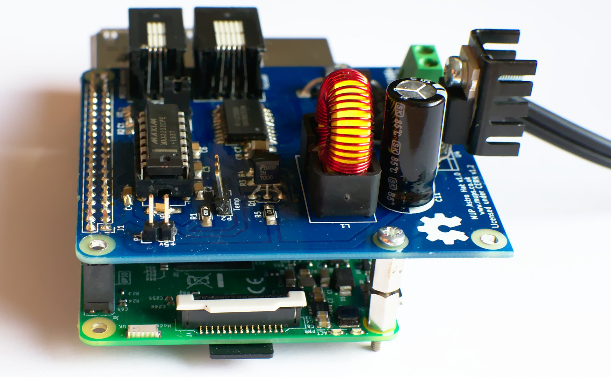

# MUP Astro CAT

The MUP Astro CAT is an auto GPIO configuring add-on board for the
Raspberry PI 3 which provides additional hardware interfaces to 
communicate and control a Meade Autostar, Moonlite focuser and
temperature sensors.

This repository contains the hardware project files needed to build 
the MUP Astro CAT. Firmware and the INDI driver is available in a separte
repo:

  https://github.com/Sector14/mup-astro-cat

Please refer to the additional documentation in the docs/ directory for
information on port pinouts for cables and hardware testing notes.

CAT refers to the Schmidt-Cassagrain telescope (CAT for short) this board will
be attached to. After naming it CAT I considered the recursive "CAP" which
would stand for "CAP Attached on Pi" since this project doesn't quite meet
the "Hat" spec, a cap is not a hat! but that means renaming things so CAT it is.

# Directories

  * control_cat - Kicad project incl schematic/pcb layout for the MUP Astro Cat. (CERN)
  * docs        - Documentation and 3rd party datasheets
  * gerber      - Exported gerber files for re-ordering PCBs

# Intended Purpose

Use a raspberry pi and additional interface board to control the 
following devices:

  * SXVR-H9
  * LodeStar
  * Filter Wheel
  * LX90 Handset
  * Moonlite Focuser
  * Illuminated Reticle (v2?)
  * Temp Sensor

The SXVR-H9, LodeStar (excl ST4 guide port) and Filter Wheel simply 
connect as USB devices to the Pi. 

The LX90 Handset uses a RS232 connection via RJ22 to the PI.

Moonlite focuser controlled via GPIO to a unipolar stepper
motor controller that will handle signal timing. Ensures any 
jitter/pauses from pi due to non realtime OS won't impact
motor control.

ST4 port from APM is not implemented, it might be added in a future
revision via i2c bus however as the LX90 supports pulse commands
over serial, it may not be needed.

# Library Setup

In addition to the libraries, modules and models that ship with Kicad,
this project also uses the MUP Kicad Library for additional parts and
an optional 3rd party 3D model library.

## Eeschema

If you receive a "The following libraries were not found:" message when
opening the schematic then you do not have the MUPS Kicad library available.
Kicad will use a cached copy of the library so this step is optional, but 
if you wish to make changes you should clone the repo:

  https://github.com/Sector14/mup-kicad-library

and add its location "Preferences/Component Libraries" as a user defined 
search path in the "parts library editor".  Then close and re-open Eeschema
and all the schematic symbols should now be found.

## Footprints

The above repo also contains footprint files for PCBNew in the modules/
directory and 3d models (where applicable). PCBNew will need each modules/\*.pretty
directory adding to the global library, or if you prefer, the project specific 
libraries.

To do so, open PCBNew, "Preferences/Footprints Libraries Manager", then 
"Append with Wizard" and select each ".pretty" directory and click Next, then
select whether to add the footprint to the global or project library.

Note: Some footprints are unchanged Kicad footprints that have only been
saved to the MUPS library in order to associate a 3d model with the footprint.
If the official Kicad library ever adds the missing models, the parts will
likely be removed from this repo.

## 3d Models

Some parts include a reference to models from the GPL'd 3d library by "kcswalter".
These are optional models and not included in the MUPS Kicad library.

If you checkout the walter repo from

  git://smisioto.eu/kicad_libs.git 

You can have Kicad use these models during 3d preview mode
by adding a new env variable in PCBNew "Preferences/Configure Paths" 
called WALTER_KI3DMOD and with the path set to the 
<walter repo checkout path>/modules/packages3d/ directory. 

Any footprints in the MUPS library that has the 3d model path prefixed 
with {WALTER_KI3DMOD}/walter/ will then use the appropriate 3D model.
The same will apply to {MUPS_KI3DMOD}/mups/ although at this time I've
yet to create any custom 3D models and find it unlikely I will

# Gerber Export

For Ordering PCBs from dirtypcbs.com

For "plotting":-

  * "Gerber" format is selected.
  * Select Layers F.Cu, B.Cu, F.SilkS, B.Mask, F.Mask, Edge.Cuts
  * Select Options:
   * Plot footprint values
   * Plot footprint references
   * Exclude PCB edge layer from other layers
  * Select Gerber Options:
   * User Protel filename extensions

For Drill file:

  * Units Inches
  * Zeros Format, Suppress leading zeros
  * Drill Map File Format (not used)
  * Drill File Options:
   * Minimal header
   * Merge PTH and NPTH holes into one file
  * Drill origin, Absolute

After export, rename the edge cuts "gm1" extension to "gml" prior
to uploading zip to dirtypcbs.com.

# Future Revision

Selecting surface 1206 style footprint for C8, the 100uF bypass capacitor 
for the DRV8805 was a little costly due to needing higher than 12V. An 
SMD electrolytic would prove significantly cheaper £0.27 vs £2.46
and with a greater voltage margin and not require that much additional 
space for a radial footprint. Lapse in judgement to be corrected on a 
future revision.

The power supply could be reduced in size with a more carefully
selected inductor. Having never laid out a SMPS however, I decided
to stick to the recommended layout and inductors based on the
TI regulator used. Further experimentation will be done prior to
revision 2 along with a change to SMD electrolytics and diodes.

A surface mounting socket to mate the CAT to the pi would be a better
choice as it allows an extended pin leg header to be mounted to the
pi and then the CAT mounted on top. This works out cheaper than the
elevated sockets.

Signal lines all need test point locations making available.

Switch 4p4c and 6p6c connector layout to socket mounting 
to allow panel mount option or in the case of a direct wiring, a
smaller connector area.

USB ideally should also be panel mount but desoldering the PI's
dual sockets is something I'd prefer to avoid.

ST3232 switch to soic version.

Add pin labels to silkscreen for temp port etc current broken square for
ground is too hard to see once a pin header is soldered in place.

Add a via behind the regulator to connect ground planes for better
thermal relief.

HAT specs for back-powering via 5V GPIO header pin requires addition
of an ideal 'safety' diode see [design guide](https://github.com/raspberrypi/hats/blob/master/designguide.md)

# Reference

  * https://github.com/raspberrypi/hats
  * https://github.com/raspberrypi/hats/blob/master/designguide.md
  * https://github.com/xesscorp/RPi_Hat_Template
  * http://www.briandorey.com/post/Raspberry-Pi-3-UART-Boot-Overlay-Part-Two

# Copyright

Copyright Gary Preston 2016.

This documentation describes Open Hardware and is licensed under the
CERN OHL v. 1.2.

You may redistribute and modify this documentation under the terms of the
CERN OHL v.1.2. (http://ohwr.org/cernohl). This documentation is distributed
WITHOUT ANY EXPRESS OR IMPLIED WARRANTY, INCLUDING OF
MERCHANTABILITY, SATISFACTORY QUALITY AND FITNESS FOR A
PARTICULAR PURPOSE. Please see the CERN OHL v.1.2 for applicable
conditions

